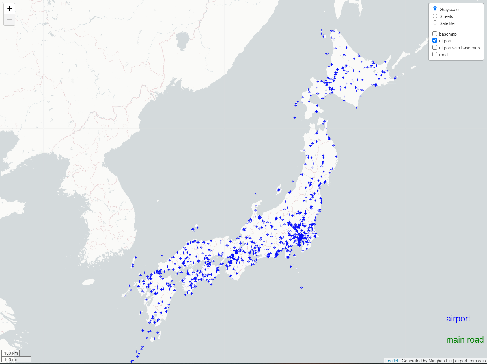

# map_tiles_visulazation
# this map base on tile image will display Japan's aipport and road distrubution in two separate layer and a base map. there is also a unique layer contains both base map and airport.
# All tiles has a zoom level from 6 to 9 both in QMetatile output setting. All layers in leaflet has zoom setting from 6 to 8 to prevent error. 
# Airport contains all airports in japan with its location. the road contains all the main road system in Japan. the base map is a simple single color map indicate japan land. The airport and base map contains both airport and base map in a single layer.
# Beside airport tile, all tiles are created from mapbox studio and input in qgis with wms as layers. The airport tile is a csv file imported directly in qgis to form a layer. These layers would be used to create tiles by the QMetaTile plugin.

# airport data source: https://ourairports.com/countries/JP/

# road data source: mapbox studio

# base map data source: mapbox studio

# airpot and base map data source: mapbox studio

